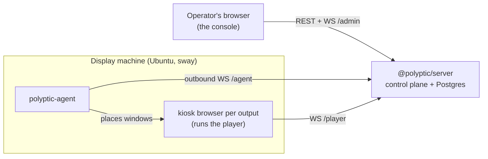

# Polyptic

> A **polyptych** is a multi-panel painting whose panels compose one picture. A wall of screens has the same relationship to the image it shows, and screens, scenes and murals all fall out of that metaphor.

Polyptic is a self-hostable system for orchestrating walls of screens and fleets of display kiosks from a web console. You describe what every screen should show and thin agents on each machine reconcile to that description. It replaces the usual fragile per-machine boot script (click here, wait, open a browser, type a password) with one declarative control plane.

Polyptic is vendor-neutral. Any web page, dashboard, image or video goes on the wall, and identity and content integrations are adapters, never foundations. The server runs on any Kubernetes cluster or Docker host. The display machines run stock Ubuntu.

## Core ideas

- **Screens, not machines.** You drive named screens ("Reception-Left", "Atrium-3"). A machine is plumbing that owns outputs. Ident mode flashes each screen's name on its physical panel, so mapping panels to names is point-and-confirm.
- **One desired state, reconciled.** The control plane holds the spatial layout (murals), the content assignments and named scenes. Each agent renders only its slice, the way a Kubernetes controller reconciles spec to status, so the fleet behaves as one system rather than N isolated kiosks.
- **Instant.** Changes propagate over WebSocket and the player patches its DOM in place, with no reload and no white flash.
- **Zero-click cold boot.** Power on, autologin, compositor, agent reconnects, content renders. No clicks, no sleeps, no typed passwords, so a wall survives an end-of-day power cut.
- **Outbound-only agents.** Machines dial out to the control plane and need to reach nothing else. The control plane also serves the OS the machines boot, so an air-gapped wall works.

## Quickstart (local dev)

Requires [Bun](https://bun.sh), plus Docker for Postgres.

```bash
bun install
bun run db:up                                  # Postgres in Docker (or set STORE=memory to skip it)
POLYPTIC_OUTPUTS="HDMI-1,HDMI-2" bun run dev   # server :8080, console :5175, player :5173, a dev agent
```

Open http://localhost:5175 and sign in with the prefilled dev account. Approve the dev machine under **Machines**, drag its screens onto the canvas, and open one player tab per screen at `http://localhost:5173/?screen=<id>`. Assign a URL or a library source to a screen and the player swaps the content live. `bun run test` runs the suite.

## How it works



| Package | Role |
|---|---|
| `@polyptic/server` | Source of truth. Machine and screen registry, murals, combined video-wall surfaces, content library, scenes, uploaded media. REST plus three WebSocket channels, `/healthz`, Prometheus `/metrics`. Serves the console and player SPAs. |
| `@polyptic/console` | The operator UI (Vue 3). Spatial wall canvas, content library, scenes, machine management, live preview thumbnails, a live activity feed. |
| `@polyptic/player` | Per-screen renderer (Vue 3). Draws its screen's slice, including spanning one piece of content across the panels of a video wall. Updates in place. |
| `@polyptic/agent` | Bun single binary on each machine. Dials out over WebSocket, drives the compositor (sway on Wayland, i3 on X11 as the fallback), launches a kiosk browser per output (Chrome native Wayland, surf fallback), captures preview thumbnails. |
| `@polyptic/protocol` | The shared contract. Every cross-process message is a zod schema, validated at the edge. |

Content never routes through the agent. The server pushes it straight to each player over the player channel, which is what makes changes instant.

Content sources are reusable library entries. A source is a link (a web page, a dashboard, an HLS stream), an uploaded file (an image, a video, a slide deck converted to images on the server), a page composed from elements, or a playlist that rotates other sources. Editing a source re-pushes it live to every screen showing it.

The console and API use local accounts (argon2id hashing, signed http-only session cookies, login rate-limiting). A machine enrols with a bootstrap token, appears as pending, and reconnects on a durable per-machine credential once an operator approves it.

## Installing it for real

The server ships as one Docker image (`ghcr.io/<owner>/polyptic-server`) bundling the control plane and both SPAs. Run it with `docker run`, the compose `full` profile in `deploy/docker-compose.yml`, or the Helm chart in `deploy/helm/polyptic`. Packaging, releases and the full environment reference are in [`docs/DISTRIBUTION.md`](docs/DISTRIBUTION.md).

Display machines network-boot a live image the server itself serves, so nothing is installed on them:

1. In the console, open **Settings → Onboard Screens** and download the network bootloader.
2. Flash it to a USB stick (2 GB or larger).
3. Boot the machine from the stick, Secure Boot on. It streams the image into RAM, brings up the kiosk stack and enrols itself.

The control-plane address and the enrolment token are baked into the boot menu the server generates, so nothing is typed on the machine. A netbooted machine re-pulls its whole OS at every boot, which makes image updates automatic. To boot without a stick, point UEFI HTTP Boot or DHCP option 67 at the server.

Once a machine dials in, approve it, ident the panels to name them, place them on a mural and assign content. The console's cold-start wizard walks through those steps. The full journey is in [`docs/ONBOARDING.md`](docs/ONBOARDING.md).

## Documentation

| Doc | Covers |
|---|---|
| [`docs/ONBOARDING.md`](docs/ONBOARDING.md) | Adding a display, end to end |
| [`docs/DEPLOY.md`](docs/DEPLOY.md) | The device side: backends, crash hardening, troubleshooting |
| [`docs/DISTRIBUTION.md`](docs/DISTRIBUTION.md) | Packaging: the server image, Helm, releases |
| [`docs/NETBOOT.md`](docs/NETBOOT.md) | The network-boot chain |
| [`docs/DEV.md`](docs/DEV.md) | Running the stack locally and working on it |
| [`docs/DESIGN.md`](docs/DESIGN.md) | The design narrative |
| [`docs/ARCHITECTURE.md`](docs/ARCHITECTURE.md) | Data model, API, technical gotchas |
